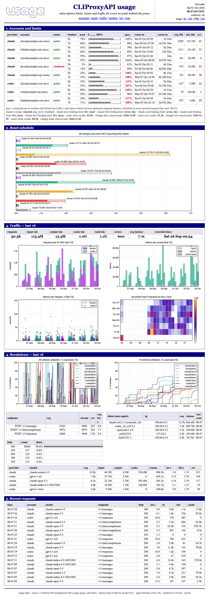

# cliproxy-dash

A tiny usage dashboard for [CLIProxyAPI](https://github.com/router-for-me/CLIProxyAPI), styled like [gnuplot.info](http://gnuplot.info/).
One Python file, standard library only, no JavaScript.



*Synthetic demo data (`python3 demo.py`): 8 fake accounts, a week of traffic.*

Shows every account's 5h/7d limits with pace projection and reset times, plus requests, tokens, latency, models and clients.

## Run

Enable the proxy's management API and usage stats in its `config.yaml`:

```yaml
remote-management:
  secret-key: "pick-a-long-random-string"   # allow-remote can stay false
usage-statistics-enabled: true
```

Then:

```sh
CPA_MGMT_KEY=pick-a-long-random-string python3 usage_dash.py
# open http://127.0.0.1:8318/
```

| Variable | Default |
| --- | --- |
| `CPA_MGMT_KEY` | required |
| `CPA_URL` | `http://127.0.0.1:8317` |
| `DASH_BIND` | `127.0.0.1:8318` (comma-separate to listen on several, e.g. a Tailscale IP) |
| `DASH_DB` | `~/.local/share/usage-dash/usage.db` |

A systemd user unit is in `systemd/`. The page has no login; bind it to localhost or a private network.

The proxy's usage queue is drained on read, so run only one collector. History starts when the dashboard starts.

> CLIProxyAPI exposes subscription sign-ins (Claude, Codex) through an API. That is a third-party integration and may not be
> approved by the providers; account-enforcement risk is yours. This dashboard only reads the proxy's own stats.

MIT
